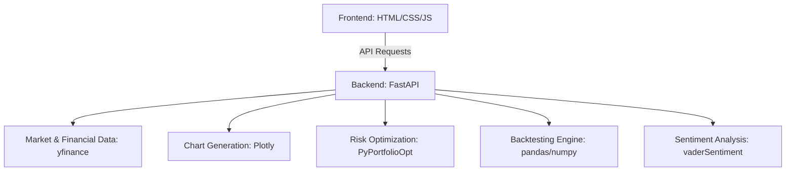

# Bloomberg Terminal Web App

A powerful, web-based financial analysis dashboard modeled after the Bloomberg Terminal. This project provides a comprehensive suite of tools for market data visualization, advanced financial valuation, portfolio risk analysis, options sentiment, and algorithmic trading backtesting.

## Features

- **Live Market Pulse & News Feed:** Real-time quote updates for major tickers and a curated news feed.
- **Interactive Candlestick Charts:** Advanced HTML5 Canvas charting with technical indicators (SMA 20/50, RSI), zoom/pan capabilities, and intraday/daily timeframes. Includes high-period alert thresholds.
- **Advanced Valuation Models:** Automated extraction of balance sheets and income statements to compute DuPont ROE, EV/EBITDA, and a simplified DCF valuation model with intrinsic price and upside targets.
- **Portfolio & Risk Optimization:** Mean-Variance Optimization (Max Sharpe), Hierarchical Risk Parity (HRP), and Monte Carlo simulations (1,000 runs) using `PyPortfolioOpt`. Includes **Discrete Allocation** to provide specific trade recommendations (shares to buy/sell).
- **Options Sentiment Analysis:** Calculation of Put/Call ratios based on near-term options chains to gauge market sentiment.
- **High-Performance Backtesting:** Vectorized backtesting engine built on `pandas/numpy` for rapid assessment of trading strategies (EMA Crossover, RSI Mean Reversion, MACD Momentum, and Bollinger Bands).
- **Command-Line Interface (CLI):** Navigate the terminal using commands like typing a ticker symbol, `BT <ticker> <strategy>` for backtesting, `SENT <ticker>` for NLP sentiment, `PORT` for portfolio optimization, and `BACK` to return to the main view.

## Architecture



## Setup and Installation

1. **Clone the repository** (if applicable) or navigate to the project folder.

2. **Create a virtual environment (optional but recommended):**
   ```bash
   python -m venv venv
   source venv/bin/activate  # On Windows: venv\Scripts\activate
   ```

3. **Install the dependencies:**
   ```bash
   pip install -r requirements.txt
   # For local development, also install uvicorn:
   pip install uvicorn
   ```

4. **Run the backend server:**
   ```bash
   # From the root directory
   uvicorn api.index:app --port 8000 --reload
   ```

5. **Access the application:**
   Open your browser and navigate to `http://localhost:8000/`.

## Usage/Commands

Use the command bar at the top left to interact with the terminal:

- **`<TICKER>`**: e.g., `AAPL` - Loads the chart, valuation, and options data for the specified ticker.
- **`PORT`** or **`RISK`**: Switches to the Portfolio Optimization view. Define tickers and sizes to run Mean-Variance and HRP optimizations. Generates specific trade recommendations for rebalancing.
- **`BT <TICKER> <STRATEGY>`**: e.g., `BT MSFT RSI` - Runs a backtest for the specified ticker. If no strategy is provided, it defaults to EMA. Supported: `EMA`, `RSI`, `MACD`, `BB`.
- **`SENT <TICKER>`**: e.g., `SENT NVDA` - Runs NLP sentiment analysis on recent news for the specified ticker.
- **`BACK`**: Returns to the default chart and news feed view.

## Technical Stack

- **Frontend:** Vanilla HTML, CSS, JavaScript (HTML5 Canvas for custom rendering)
- **Backend:** Python (FastAPI)
- **Data & Analysis:** `yfinance`, `pandas`, `numpy`, `scipy`
- **Quantitative Libraries:** `PyPortfolioOpt`, `vaderSentiment`
- **Visualization:** `plotly` (for API-generated charts)
